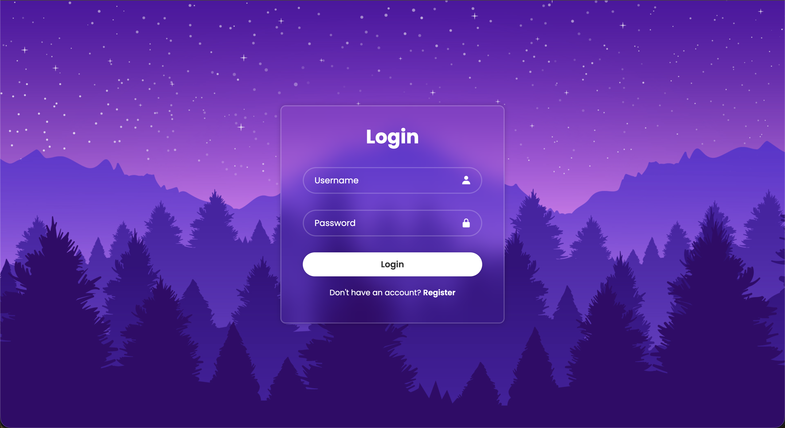
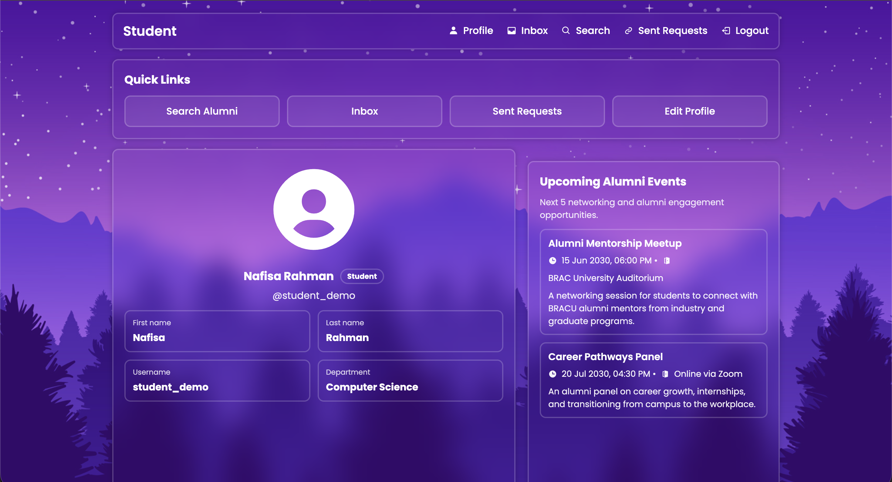
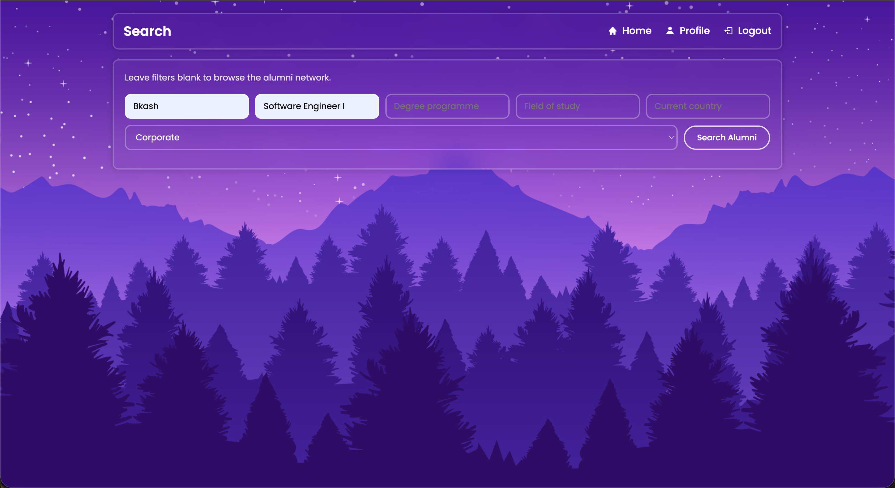
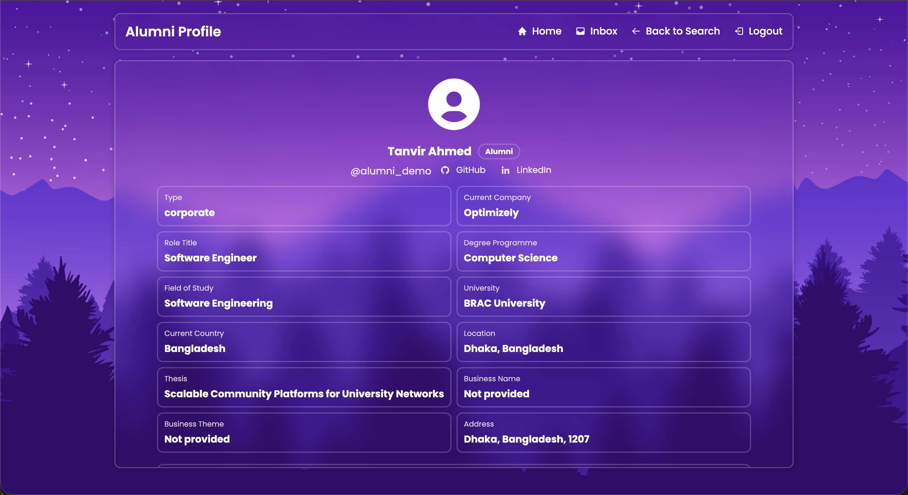
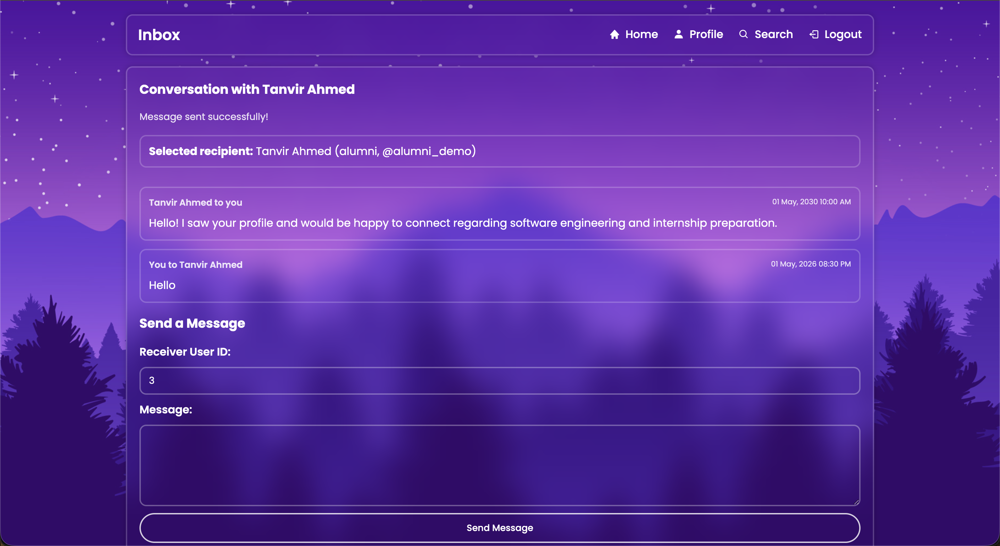
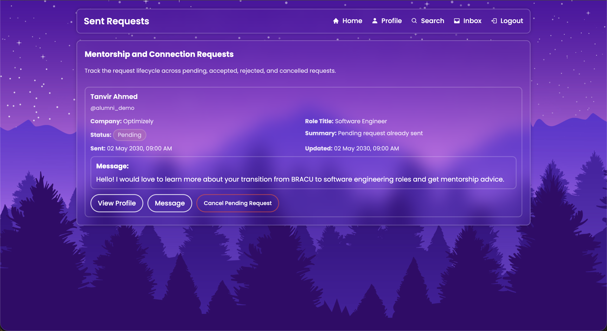
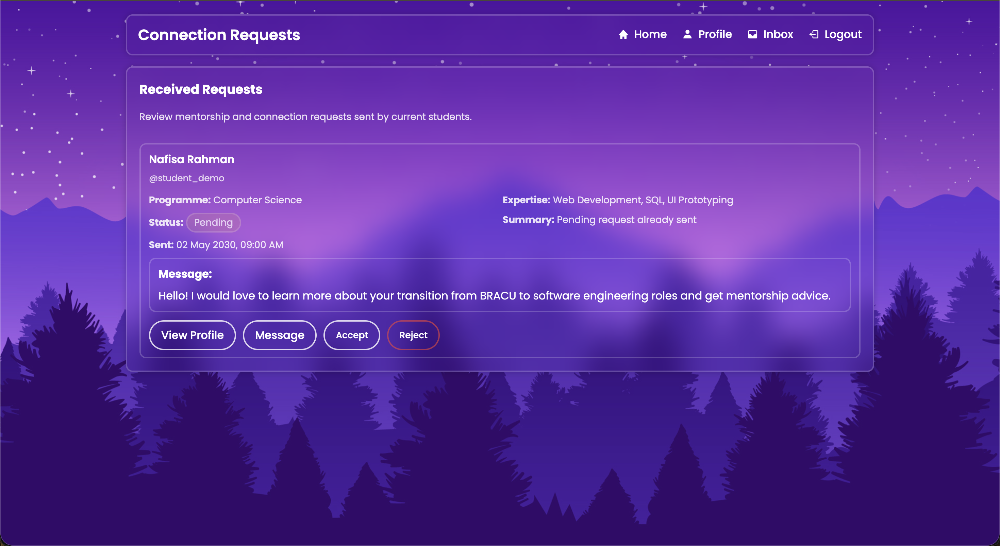
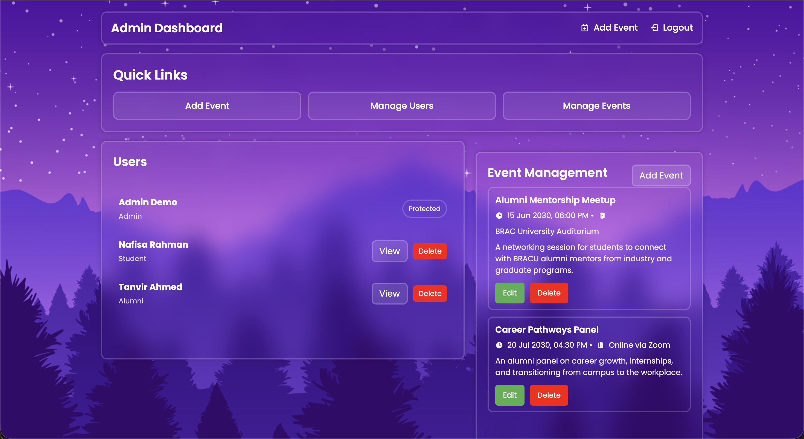
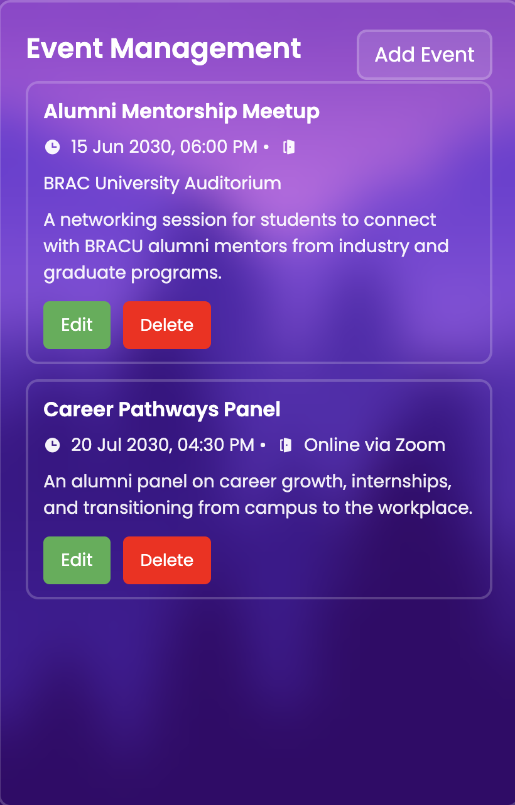

# BRACU Alumni Connect

BRACU Alumni Connect is a role-based alumni networking platform built with PHP and MySQL for connecting students, alumni, and administrators through discovery, messaging, connection requests, and event management.

It was developed as an academic database-driven web application and polished into a portfolio project that highlights SQL schema design, relational modeling, secure PHP/MySQL patterns, and practical web application structure.

## Why This Project Exists

University communities often have strong alumni networks but weak digital pathways for discovery, outreach, and mentorship. This project explores how a structured relational database and a lightweight PHP application can support:

- student-to-alumni discovery
- mentorship and networking outreach
- alumni visibility and engagement
- administrative oversight of users and events

## Tech Stack

- PHP
- MySQL / MariaDB
- SQL
- HTML
- CSS
- `mysqli`

## Project Highlights

- Role-based platform for students, alumni, and admins
- Search and filtering flows for alumni discovery and student discovery
- Public view-only profile pages for safe profile browsing
- Secure login flow with password hashing and session hardening
- CSRF-protected forms for sensitive state-changing actions
- Prepared statements across authentication, search, profile updates, requests, and admin actions
- Messaging with recipient prefill from search and profile pages
- Mentorship / connection request lifecycle with send, view, accept, reject, and cancel actions
- Admin event management with add, edit, and delete flows

## Features By Role

### Student

- Register and log in
- Edit personal profile and upload a PDF CV
- Search alumni by company, role, degree programme, field of study, country, and alumni type
- View public alumni profiles
- Send direct messages to alumni
- Send mentorship / connection requests
- Track all sent requests and cancel pending ones
- View upcoming alumni events

### Alumni

- Register and log in
- Edit personal alumni profile
- Search students by programme, expertise, minimum CGPA, city, and country
- View public student profiles
- Send direct messages to students
- Review received mentorship / connection requests
- Accept or reject student requests
- View upcoming alumni events

### Admin

- Log in with seeded admin credentials
- View users by role
- Open public student and alumni profiles
- Delete non-admin users
- Add, edit, and delete events
- Monitor platform activity through user and event dashboards

## Security Features

- Passwords stored with `password_hash()` and verified with `password_verify()`
- Prepared statements used for login, search, profile updates, messaging, requests, and admin event actions
- Session hardening with `session_regenerate_id(true)` on login
- Role-based access control for student, alumni, and admin pages
- CSRF protection on sensitive POST forms
- Output escaping with `htmlspecialchars()` via shared helper functions
- PDF-only CV upload validation with size limits and randomized filenames
- Integer validation for IDs and basic validation for email and event date inputs

## Database Design Summary

The project uses a relational schema centered around a shared `users` table, with role-specific extensions for students and alumni and separate modules for platform interaction.

- `users`: authentication and shared identity fields
- `students`: student profile data, academic info, contact links, CV path
- `alumni`: alumni profile data, career / higher studies details, professional metadata
- `events`: admin-managed alumni and networking events
- `messages`: direct user-to-user communication
- `connection_requests`: mentorship / networking requests from students to alumni

This design keeps shared identity data centralized while separating role-specific fields into dedicated tables, which makes the model easier to query, explain, and extend.

## Repository Guide

- [config/DBconnect.php](config/DBconnect.php): database connection bootstrap
- [includes/auth.php](includes/auth.php): shared auth, session, CSRF, escaping, and routing helpers
- [auth/](auth): login, signup, and logout pages
- [student/](student): student dashboard, profile, search, and sent request pages
- [alumni/](alumni): alumni dashboard, profile, search, and received request pages
- [admin/](admin): admin dashboard and event/user management pages
- [shared/](shared): inbox, public profiles, and connection request submit flow
- [assets/css/](assets/css): project stylesheets
- [assets/images/](assets/images): shared image assets
- [sql/schema.sql](sql/schema.sql): database schema
- [sql/seed.sql](sql/seed.sql): demo seed data
- [uploads/](uploads): uploaded student CV files
- [screenshots/](screenshots): repository screenshot placeholders or exports
- [.env.example](.env.example): example database environment variable names
- [PROJECT_SUMMARY.md](PROJECT_SUMMARY.md): interview-focused technical summary
- [CHANGELOG.md](CHANGELOG.md): project evolution by phase

## Local Setup on macOS

### Requirements

- macOS
- PHP 8.x available in Terminal
- MySQL or MariaDB running locally

### 1. Clone the repository

```bash
git clone <your-repo-url>
cd myProject
```

### 2. Create the database

Import the schema:

```bash
mysql -u root -p < sql/schema.sql
```

Import the demo data:

```bash
mysql -u root -p < sql/seed.sql
```

If your MySQL username is not `root`, replace it with your local username.

### 3. Configure database credentials

This project reads database settings from environment variables if they are exported before PHP starts.

Expected variables are documented in [.env.example](.env.example):

- `DB_HOST`
- `DB_PORT`
- `DB_NAME`
- `DB_USER`
- `DB_PASS`

Export them in your shell using your actual local MySQL password:

```bash
export DB_HOST=127.0.0.1
export DB_PORT=3306
export DB_NAME=university
export DB_USER=root
export DB_PASS='your_actual_mysql_password'
```

If your local MySQL root account has no password, set `DB_PASS` to an empty string for your own machine only. As a fallback, you can also edit the local defaults in [config/DBconnect.php](config/DBconnect.php).

Note: this repository includes `.env.example` as a reference file, but the application does not auto-load a `.env` file with a dotenv library.

### 4. Start the PHP built-in server

```bash
php -S localhost:8000
```

### 5. Open the project

Visit either the root landing page or the auth entry page:

```text
http://localhost:8000/
http://localhost:8000/auth/index.php
```

## Demo Credentials

These demo accounts are inserted by [sql/seed.sql](sql/seed.sql).

| Role | Username | Password |
| --- | --- | --- |
| Admin | `admin_demo` | `Admin123` |
| Student | `student_demo` | `Student123` |
| Alumni | `alumni_demo` | `Alumni123` |

## Screenshots

### Login Page


### Student Dashboard


### Alumni Discovery


### Public Alumni Profile


### Messaging Inbox


### Student Sent Requests


### Alumni Received Requests


### Admin Dashboard


### Admin Event Management


## Future Improvements

- Add pagination and sorting for search and request pages
- Add a dedicated accepted connections view
- Add notifications for accepted or rejected mentorship requests
- Add RSVP tracking for events
- Improve mobile responsiveness and visual polish
- Add automated tests and deployment instructions

## Resume Copy

**BRACU Alumni Connect | Alumni Networking Platform**  
**PHP, MySQL, SQL, Database Design, Secure Web App Fundamentals**

- Developed a database-driven alumni networking platform connecting students, alumni, and administrators through role-based dashboards, profile management, discovery filters, messaging, events, and mentorship requests.
- Designed and implemented a relational MySQL schema for users, student/alumni profiles, events, messages, and connection requests, supported by SQL schema and seed files for local setup.
- Improved application security using password hashing, prepared statements, session-based role access control, CSRF protection, input validation, safe PDF upload handling, and escaped output.